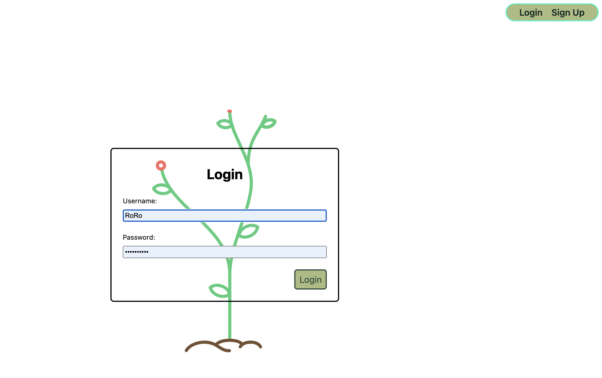
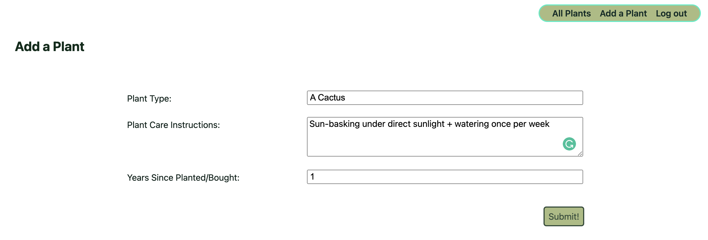
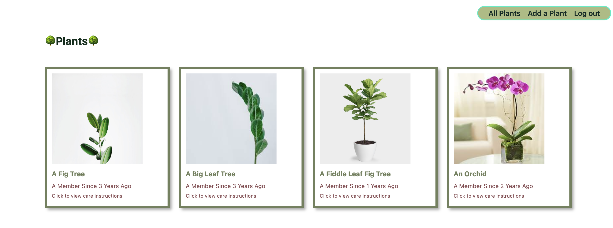
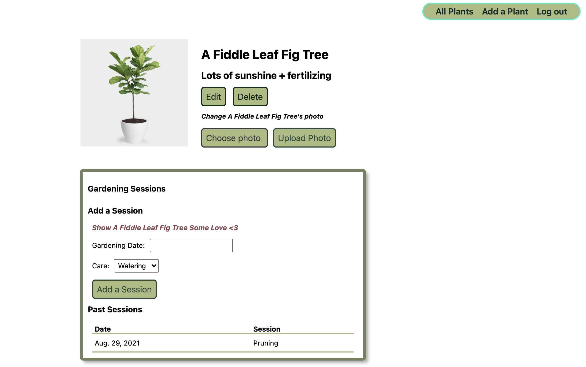

# thegardeningproject
-------------------------------------------------------
# [Click to view the app](https://summerunit4.herokuapp.com/)
-------------------------------------------------------
# Motivation: 

I've always wanted to build something that can keep track of all the plants that I have, and what was taught in the Django lecture was a perfect fit for such functionalities. While the app may not be suitable for a large-scale plant nursery, it definitely can evolve into one.

-------------------------------------------------------
# Description: 
- In this App, the users will need to sign up and log in with their own credentials.
- After the user logs in, he/she can add a plant that they own and document how long he/she has owned it.
- He/She can keeps tracks of when they last took care of the plant, and what they did to the plant.
- He/She can upload a picture of the plant
- He/She can delete the plant

-------------------------------------------------------

# Technologies Used: 
- JS, HTML, CSS, Django, Lottie

-------------------------------------------------------

# Screenshots

